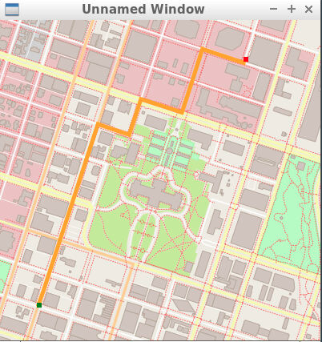

# Route Planning Project

This repo contains the starter code for the Route Planning project.



## Dependencies for Running Locally
* cmake >= 3.11.3
  * All OSes: [click here for installation instructions](https://cmake.org/install/)
* make >= 4.1 (Linux, Mac), 3.81 (Windows)
  * Linux: make is installed by default on most Linux distros
  * Mac: [install Xcode command line tools to get make](https://developer.apple.com/xcode/features/)
  * Windows: [Click here for installation instructions](http://gnuwin32.sourceforge.net/packages/make.htm)
* gcc/g++ >= 7.4.0
  * Linux: gcc / g++ is installed by default on most Linux distros
  * Mac: same instructions as make - [install Xcode command line tools](https://developer.apple.com/xcode/features/)
  * Windows: recommend using [MinGW](http://www.mingw.org/)
* IO2D
  * Installation instructions for all operating systems can be found [here](https://github.com/cpp-io2d/P0267_RefImpl/blob/master/BUILDING.md)
  * This library must be built in a place where CMake `find_package` will be able to find it

## Compiling and Running
## Build instructions on Mac
`git clone https://github.com/microsoft/vcpkg`
`cd vcpkg`
`./vcpkg install io2d`
`cmake -DCMAKE_TOOLCHAIN_FILE=/Users/wenkairen/vcpkg/scripts/buildsystems/vcpkg.cmake ..`
`make -j8`

### Running
specify a map file:
```
./OSM_A_star_search -f ../<your_osm_file.osm>
```
```
Those commands will build the code with the appropriate tests exercise. The tests can then be run from the `build` directory as follows:
```
../bin/test
```
Not all exercises have tests. The table is given below with the complete list of exercises with tests for reference:

| Exercise Name               | 
|-----------------------------|
| The RouteModel Class        |
| The Node Class              |
| Create RouteModel Nodes     |
| Write the Distance Function |
| Create Road to Node Hashmap |
| Write FindNeighbors         |
| Find the Closest Node       |
| Write the A* Search Stub    |
| Finish A* Search            |
